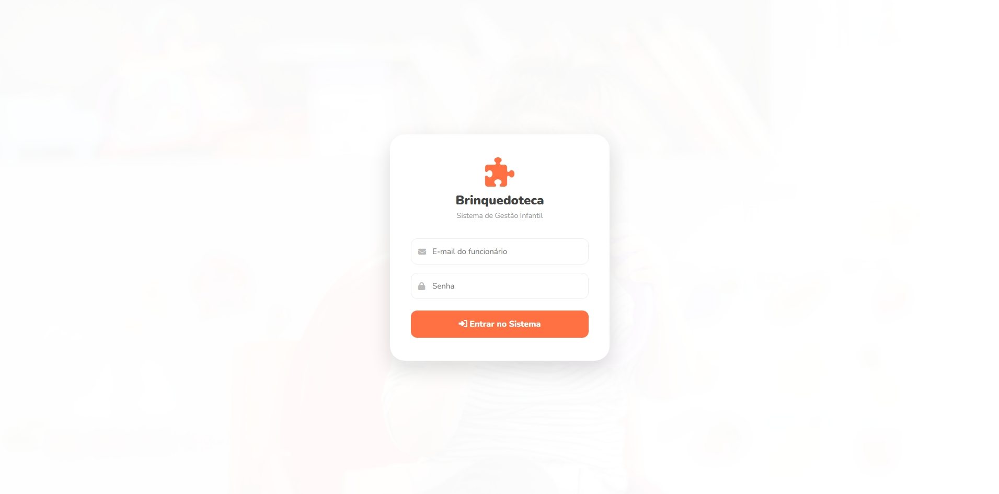
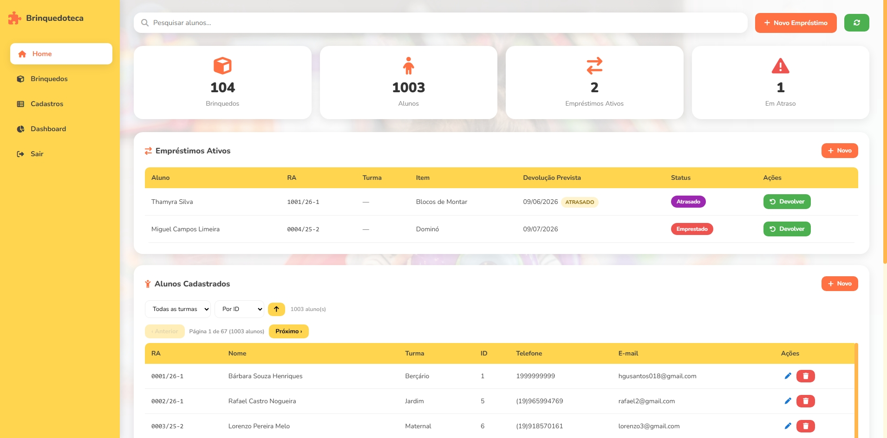
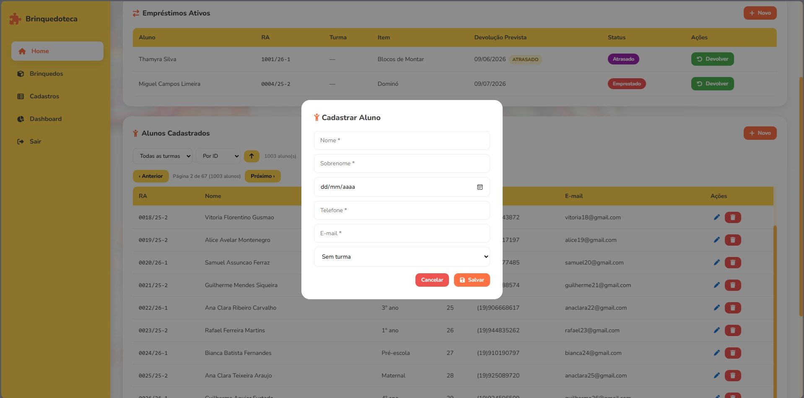
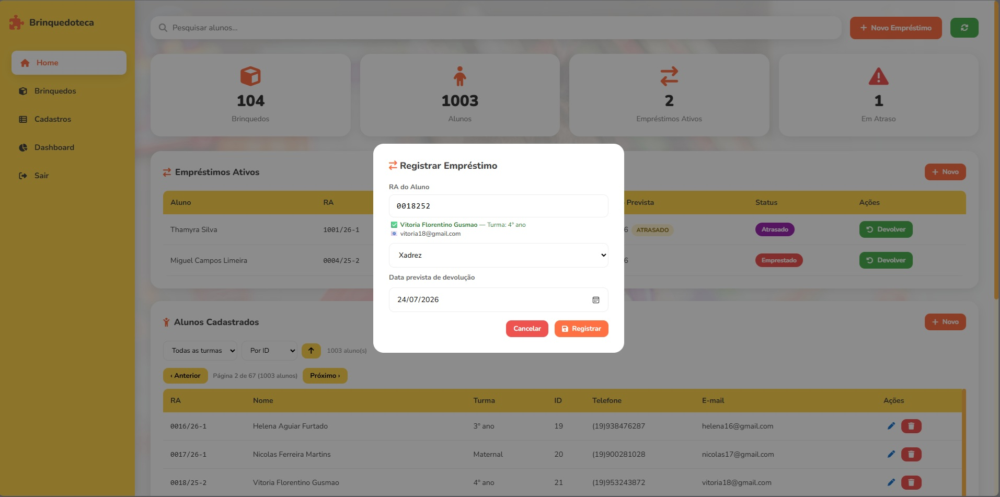
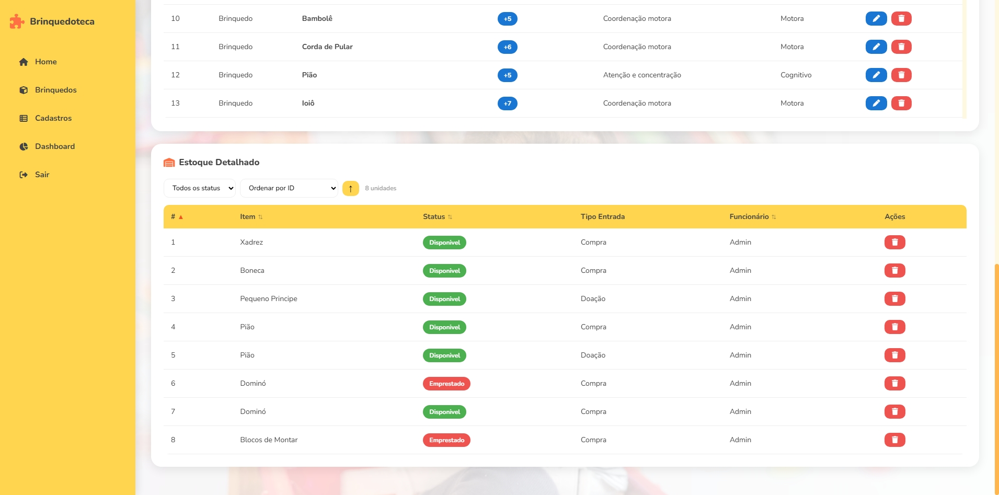
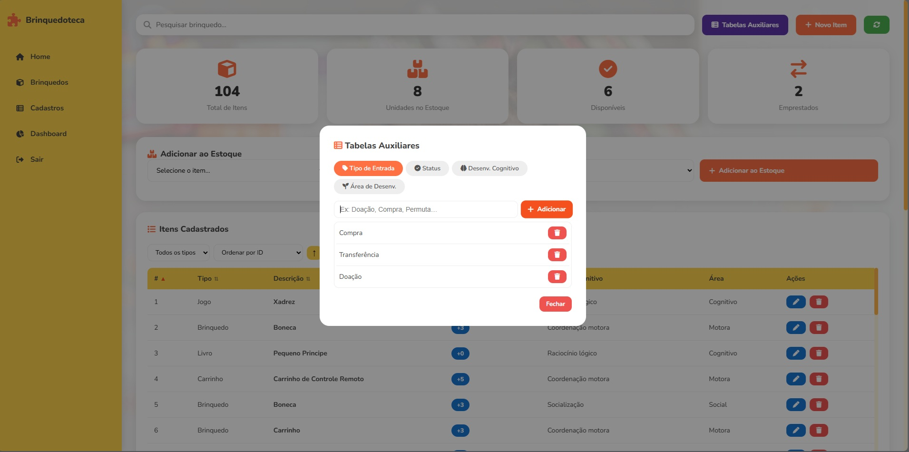
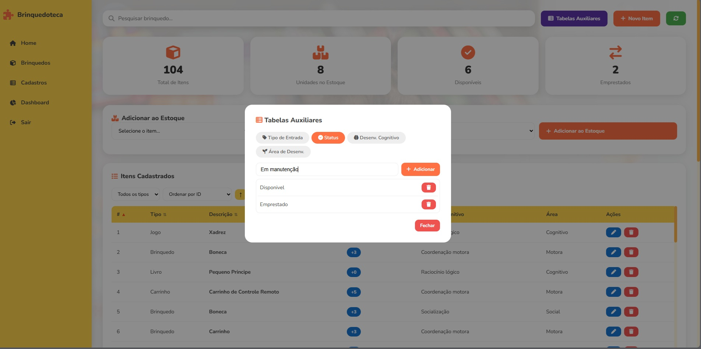
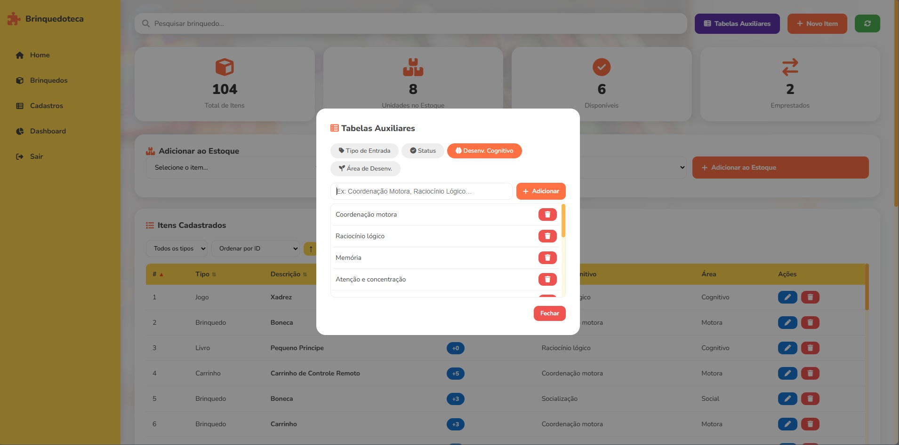
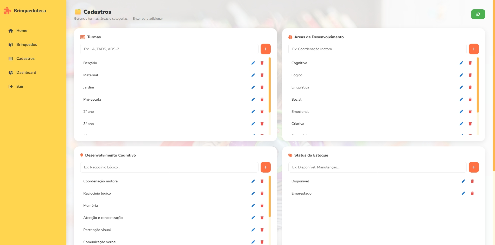
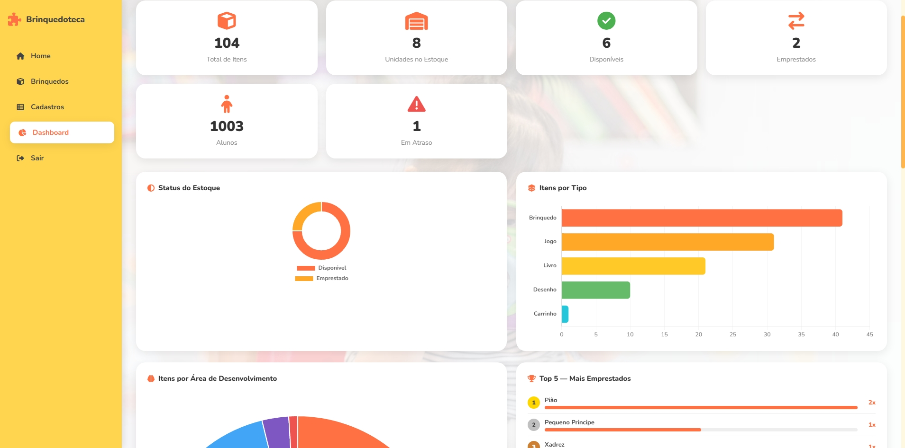

# Sistema de Gestão de Brinquedoteca

Projeto acadêmico desenvolvido como parte dos requisitos de avaliação do curso de **TADS – Tecnologia em Análise e Desenvolvimento de Sistemas** da **UNIEINSTEIN – Centro Universitário Einstein de Limeira**, com o objetivo de aplicar na prática os conceitos de análise, desenvolvimento e organização de sistemas voltados ao ambiente educacional.

---

## Equipe

| Nome | RA |
|---|---|
| Carlos Daniel Prates | 0771/26-1 |
| Gabriel Henriques dos Santos | 0244/25-1 |
| Gustavo Henriques dos Santos | 2101/19-1 |
| Jean Milo de Oliveira | 0215/09-0 |

---

## Sobre o Projeto

O sistema tem como objetivo auxiliar professores supervisores e funcionários de brinquedotecas escolares no gerenciamento do acervo de brinquedos e jogos, no controle de empréstimos e no acompanhamento dos alunos. A solução oferece uma interface web intuitiva integrada a uma API REST, centralizando as operações de cadastro, estoque, empréstimos e geração de relatórios.

---

## Stack Tecnológica

| Camada | Tecnologia | Versão |
|---|---|---|
| Backend | ASP.NET Core (C#) | .NET 8 |
| Banco de Dados | PostgreSQL | 18.3 |
| ORM | Entity Framework Core + Npgsql | 8.0.25 / 8.0.9 |
| Autenticação | JWT Bearer | — |
| E-mail | MailKit | 4.16.0 |
| Documentação | Swagger / OpenAPI | 6.6.2 |
| Frontend | HTML5 + CSS3 + JavaScript | — |
| IDE | Visual Studio 17.x / VS Code 1.117 | — |

---

## Telas do Sistema

### Login


Ponto de entrada do sistema. O funcionário realiza autenticação via login e senha. O acesso é protegido por **JWT Bearer Token**, garantindo que apenas usuários cadastrados operem o sistema.

---

### Home — Painel Principal


Painel central com visão geral e rápida da brinquedoteca. Exibe em cards os totais de **brinquedos cadastrados**, **alunos**, **empréstimos ativos** e **itens em atraso**. Abaixo dos cards, lista os empréstimos ativos com status em tempo real e a relação completa de alunos cadastrados, com filtros por turma e ordenação configurável.

---

### Cadastro de Aluno


Modal de registro de novos alunos. O funcionário informa nome, sobrenome, data de nascimento, telefone, e-mail e turma. Ao salvar, o sistema gera automaticamente o **RA (Registro do Aluno)** com base no ano e sequência de cadastro, eliminando a necessidade de atribuição manual.

---

### Registrar Empréstimo


Modal de registro de empréstimos. O funcionário informa o **RA do aluno** (com busca automática que exibe nome, turma e e-mail para confirmação), seleciona o **item disponível no estoque** e define a **data prevista de devolução**. O sistema valida a disponibilidade do item antes de confirmar o registro.

---

### Brinquedos — Gestão do Acervo


Tela central de gerenciamento do acervo. Exibe todos os itens cadastrados com tipo, descrição, faixa etária, desenvolvimento cognitivo e área de desenvolvimento. Permite pesquisa por nome, filtros por tipo e ordenação por diferentes colunas. O botão **Tabelas Auxiliares** abre o modal de gerenciamento das tabelas de apoio.

---

### Tabelas Auxiliares — Tipo de Entrada


Gerenciamento das origens de entrada de itens no estoque. Os tipos cadastrados (ex: **Compra**, **Doação**, **Transferência**) são usados na adição de unidades ao estoque. Permite adicionar e remover opções dinamicamente sem necessidade de alteração no código.

---

### Tabelas Auxiliares — Status do Estoque


Gerenciamento dos status possíveis para cada unidade no estoque. Os status (ex: **Disponível**, **Emprestado**) controlam a disponibilidade dos itens para empréstimo e alimentam os gráficos do Dashboard.

---

### Tabelas Auxiliares — Desenvolvimento Cognitivo


Gerenciamento das categorias de desenvolvimento cognitivo associadas a cada item (ex: **Coordenação motora**, **Raciocínio lógico**, **Memória**, **Atenção e concentração**). Essas categorias enriquecem o cadastro pedagógico dos brinquedos e alimentam os gráficos do Dashboard.

---

### Cadastros — Tabelas de Apoio


Tela dedicada ao gerenciamento completo das tabelas de apoio do sistema em uma única interface: **Turmas**, **Áreas de Desenvolvimento**, **Desenvolvimento Cognitivo** e **Status do Estoque**. Cada seção permite adicionar, editar e remover registros com Enter para adição rápida.

---

### Dashboard — Relatórios e Indicadores


Painel analítico com indicadores e gráficos gerados a partir dos dados do sistema. Apresenta o **status do estoque** (donut chart disponível × emprestado), **itens por tipo** (brinquedo, jogo, livro, etc.), **itens por área de desenvolvimento** e o **ranking Top 5 mais emprestados**. Projetado para apoiar decisões sobre aquisição e organização do acervo.

---

## Arquitetura do Projeto

```
BrinquedotecaAPI/
└── Brinquedoteca/
    ├── Controllers/          # Endpoints REST
    ├── Models/               # Entidades do banco
    ├── Services/             # Regras de negócio
    │   ├── RAService             → geração automática de RA
    │   ├── EmprestimoService     → lógica de empréstimos
    │   ├── EmailService          → envio de notificações
    │   └── NotificacaoService    → alertas de atraso
    ├── BackgroundService/    # Verificação periódica de empréstimos
    ├── DTO/                  # Data Transfer Objects
    └── wwwroot/              # Frontend
        ├── index.html
        ├── dashboard.html
        ├── itens.html
        ├── cadastros.html
        └── login.html
```

---

## Como Executar

### Pré-requisitos

- [.NET 8 SDK](https://dotnet.microsoft.com/download/dotnet/8.0)
- [PostgreSQL](https://www.postgresql.org/download/)
- Conta Gmail com [Senha de App](https://support.google.com/accounts/answer/185833) habilitada

### 1. Clone o repositório

```bash
git clone https://github.com/GustavoHenriques99/Brinquedoteca.git
cd Brinquedoteca/BrinquedotecaAPI
```

### 2. Configure as credenciais

Copie o arquivo de exemplo e preencha com seus dados locais:

```bash
cp Brinquedoteca/appsettings.Development.example.json Brinquedoteca/appsettings.Development.json
```

```json
{
  "ConnectionStrings": {
    "ConnectionPostgres": "Server=localhost; Port=5432; User Id=postgres; Password=SUA_SENHA; Database=db_brinquedoteca"
  },
  "EmailSettings": {
    "Email": "seu_email@gmail.com",
    "Senha": "senha_de_app_gmail",
    "Host": "smtp.gmail.com",
    "Port": 587
  }
}
```

> ⚠️ O arquivo `appsettings.Development.json` está no `.gitignore` e **nunca deve ser versionado**.

### 3. Crie o banco de dados

```sql
CREATE DATABASE db_brinquedoteca;
```

Importe o backup:

```bash
psql -U postgres -d db_brinquedoteca -f BancoBackup/db_brinquedotecaBK.sql
```

### 4. Execute

```bash
cd Brinquedoteca
dotnet run
```

Acesse em `https://localhost:PORTA/login.html` — a documentação Swagger estará em `/swagger`.

---

## Requisitos Funcionais Implementados

| # | Funcionalidade |
|---|---|
| RF01 | Painel principal com resumo do sistema |
| RF02 | Visualização e filtro do estoque |
| RF03 | Cadastro de itens no estoque |
| RF04 | Pesquisa por nome, tipo e status |
| RF05 | Cadastro de alunos com geração automática de RA |
| RF06 | Consulta e busca de alunos |
| RF07 | Registro de empréstimos |
| RF08 | Controle de devoluções |
| RF09 | Controle de status (ativo, devolvido, em atraso) |
| RF10 | Notificação automática por e-mail para atrasos |
| RF11 | Dashboard com gráficos e ranking |
| RF12 | Gerenciamento de tabelas auxiliares |

---

> Projeto desenvolvido em 2026 — TADS · UNIEINSTEIN Limeira
